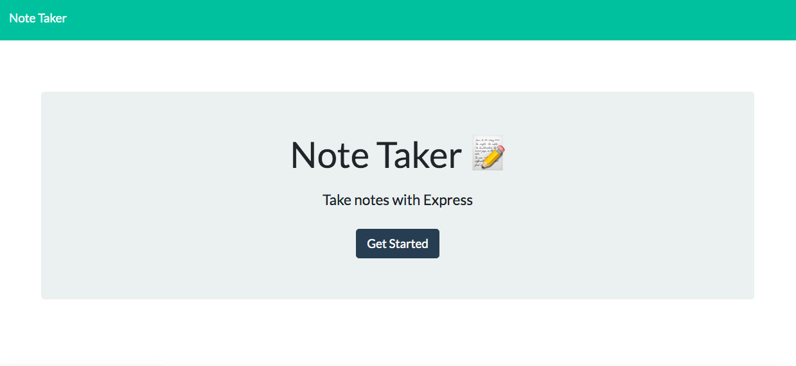
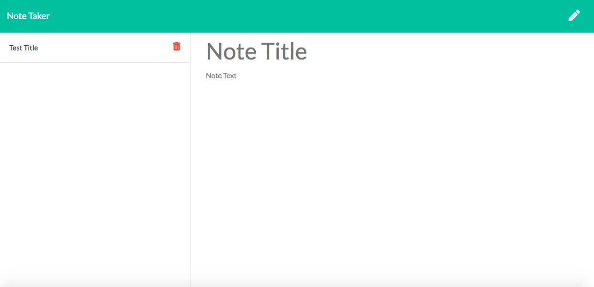
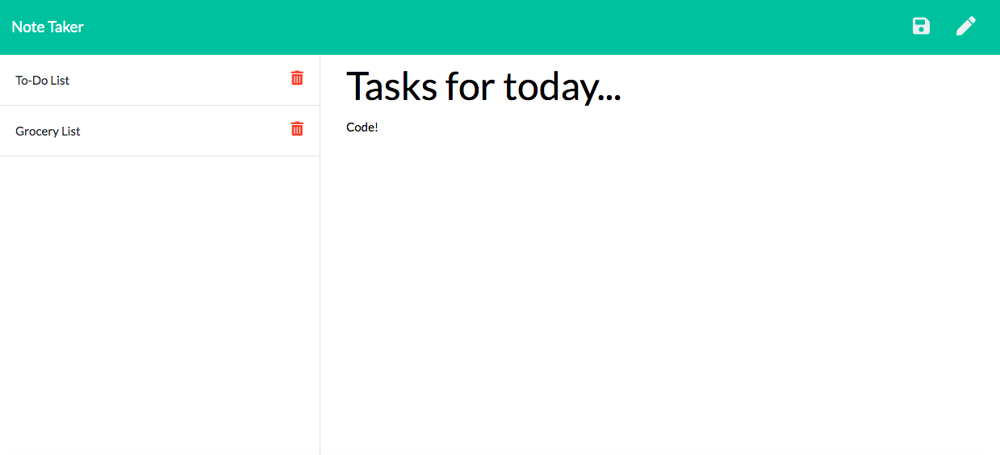

# note_taker

## Description

This is an application that can be used to write, save, and delete notes for the user's purpose. This app allows the user to keep track of notes that are organized and easy to retrieve. For this activity, the frontend was provided and it was my task to build the backend and connect both ends using HTML routes and API routes. The notes are saved and retrieved from a JSON file and the functionality uses an express backend.  

Deployed: https://gentle-inlet-29060.herokuapp.com/

### Image of Home Page

### Image of Blank Notes Page

### Image of Notes Page with Saved Info

